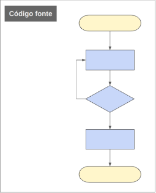
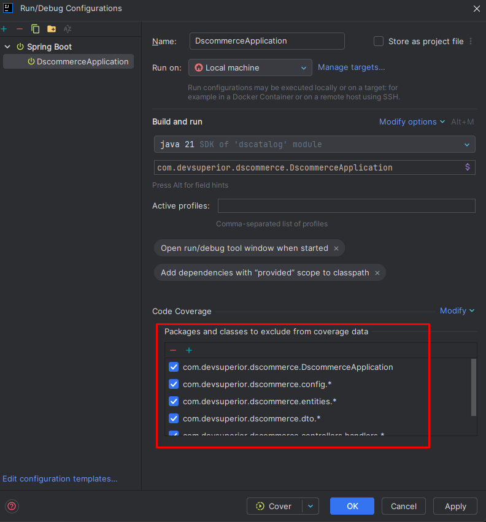

<p align="center">
  
</p>

# Competências

## Parte 1: Avançando nos testes unitários
- Abordagens de teste
  - Caixa branca
  - Caixa preta
- Principais anotações Mockito
  - @Mock
  - @Spy
  - @InjectMocks
  - Exemplo utilização @Mock, @Spy e @InjectMocks

## Parte 2: Cobertura de código com Jacoco

- Tipos básicos de cobertura de código/testes
  - Statement Coverage (Line Coverage)
  - Branch Coverage
  - Function Coverage
- Discussão
- Ferramentas para cobertura
- JaCoCo
  - Dependência
- Recursos importantes
- Exercícios

# Tópicos

# Objetivo

Conforme visto acima, este estudo será divido em duas partes, iremos começar com a primeira a seguir.

# UML

# Parte 1: Avançando nos testes unitários

Essa parte em suma é uma adição do que fora estudado previamente nos testes unitários.

## Abordagens de teste

Uma das partes principais deste processo é o teste de software, cujo objetivo é descobrir sistematicamente diferentes 
classes de erros com uma quantidade de tempo e esforço mínimos. 

Os testes de software podem ser divididos em dois grupos: **caixa branca e caixa preta**

### Caixa branca

Possui este nome, pois o tester tem acesso à estrutura interna da aplicação. Portanto, o seu foco é garantir que os componentes
do software estejam corretos/precisos.

O teste da caixa branca é realizado diretamente no código-fonte, ou seja, ele analisa a estrutura interna dos 
componentes do sistema.

Além disso, nesta técnica, é analisado os caminhos básicos do software e a ideia é que esses caminhos sejam testados.

Um dos principais testes de caixa branca, são os **testes unitários**.



⬆️ Mostrando o acesso direto ao código-fonte.

### Caixa preta

É baseado nos requisitos básicos do software. O foco é nos requisitos da aplicação, ou seja, **nas ações que ela deve
desempenhar**.

Diferente do caixa branca, os testes aqui **desconsideram o código-fonte no teste**, por isso é chamado de caixa preta.
Portanto, quando utilizamos o teste caixa preta, não nos preocupamos com os elementos constitutivos do software, **nos
preocupamos somente como ele funciona**.

Os principais teste de caixa preta são: **testes de integração** e de **API**.


⬆️ Analisando somente os requisitos, não se observa o código-fonte.

### Vantagens

As principais vantagens dos testes unitários é proteger recursos já implementados de serem quebrados a medida que o
código muda. Além disso, proporciona ao desenvolvedor um sendo de proteção da aplicação contra bugs.

# Principais anotações Mockito

## @Mock

Essa anotação em testes unitários é um objeto que implementa o comportamento de algum componente do sistema. Em outras
palavras, **ele vai substituir dependências**. É muito usado para incluir alguma dependência (repository ou service).

## @Spy

A ideia dessa anotação é que nos permita **encapsular a instância de algum objeto existente**. De certa forma, é como
se ele **realmente espionasse algum objeto real**. De uma forma padrão, o Spy irá delegar as chamadas de métodos para 
esse objeto real e rastrear as chamadas e parâmetros.

Ele é usado em circunstâncias bem mais específicas quando comparado ao @Mock, veja:

- Simular comportamento de um método da mesma classe que está sendo testada.
- Testes Unitários em sistemas legados.

## @InjectMocks

Usado para instanciar o objeto testado automaticamente e injetar todas as dependências anotadas @Mock e @Spy.

## Exemplo utilizando @Mock, @Spy e @InjectMocks

Considere um serviço ProductService, que implementa os métodos insert e update de Produtos.

Cada produto é composto pelos campos: id, name e price. Ambos os métodos utilizam uma função ``validateData()``, 
responsável por validar se o nome não é vazio e se o preço é positivo.

Implemente os testes unitários da camada de serviços para os métodos insert e update considerando os cenários de teste.

Observação: Assuma que não estamos usando lib de validação.

[Repositório](https://github.com/devsuperior/poc-example-mock-spy)

Primeira coisa, criar o teste "ProductServiceTests", com a anotação @ExtendWith(SpringExtension.class). Essa anotação diz ao spring para não carregar o contexto da aplicação,
permitindo que usemos os recursos do Spring e JUnit.

Segunda coisa, injetar a classe a ser testada "ProductService", com @InjectMocks.

Após isso, colocar também o Repository a ser usado com @Mock.

O @InjectMocks injeta automaticamente o Repository (com @Mock) dentro da instancia de ProductService que está sendo testado.

Agora, precisamos simular o comportamento do repository (do save e do getReferenceById), que estão sendo usados dentro dos métodos do ProductService.

Para fazer isso, fazemos aquele setUp, montando os possíveis cenários, igual no estudo passado.

Para simular esses cenários, precisamos olhar o comportamento dos métodos. 

O insert, por exemplo, utiliza o save, faremos o seguinte:

1. Instanciaremos um Product e um ProductDTO (fora e depois dentro do setUp)
2. Criaremos o cenário, usando o ``any`` e retornando um Product (afinal, é o que acontece no Service, ele retorna uma entity), veja:


Agora o getReferenceById é diferente. Se você observar no método do Service, caso o ID não exista ele vai retornar uma exception.

Fazemos o teste de cenário com ID existente e um com não existente (criando um nonExistingId), igual no outro estudo.


Finalizamos o teste de comportamento do Repository e agora, vamos pros métodos em sí utilizando @Spy.

### Testando Insert

No método insert do ProductService, na primeira linha ele já tem o método validateData, passando o DTO. Portanto, já temos um teste de insert com dois cenários, com data válida e inválida.

Data inválida seria: nome vazio, preço nulo ou menor que zero.

Temos um problema. O método validateData está dentro do ProductService, e como ele é protected só pode ser usado por quem está dentro do pacote. Como fazer para simular o seu comportamento? Nós usaremos o Spy, veja abaixo:

#### InsertWithValidData

```java
    @Test
    public void InsertShouldReturnProductDTOWhenValidData() {
        //criando uma variável do tipo ProductService com o Spy, 
        // espionando o service lá de cima com @InjectMocks
        ProductService serviceSpy = Mockito.spy(productService);

        //é um doNothing porque nesse caso, é um caso de sucesso
        Mockito.doNothing().when(serviceSpy).validateData(productDTO);

        //instanciando o resultando, fazendo a ação
        ProductDTO result = serviceSpy.insert(productDTO);

        //verificações
        Assertions.assertNotNull(result);
        Assertions.assertEquals(result.getName(), "Playstation");
    }
```

#### InsertWithInvalidData (name e price)

##### Name

```java
    @Test
    public void inserShouldReturnInvalidDataExceptionWhenNameIsEmpty() {
        //settando nome nulo
        productDTO.setName("");
        
        //fazendo o Spy novamente
        ProductService serviceSpy = Mockito.spy(productService);

        //dessa vez com doThrow, pois esperamos uma exception
        Mockito.doThrow(InvalidDataException.class)
                .when(serviceSpy).validateData(productDTO);

        //verificando
        Assertions.assertThrows(InvalidDataException.class, () -> serviceSpy.insert(productDTO));
    }
```

##### Price

```java
    @Test
    public void InsertShouldReturnInvalidDataExceptionWhenPriceIsNullOrLessThanZero() {
        productDTO.setPrice(-5.0);
        
        ProductService serviceSpy = Mockito.spy(productService);

        Mockito.doThrow(InvalidDataException.class)
                .when(serviceSpy).validateData(productDTO);

        Assertions.assertThrows(InvalidDataException.class, () -> serviceSpy.insert(productDTO));
    }
```

### Testando Update

O método update recebe dois parâmetros, um Long id e um ProductDTO, ele faz um try-catch e um validateData também.

Temos então, os seguintes cenários:

#### Update com id existente e data válida

```java
    @Test
    public void updateShouldUpdateWhenIdExistsAndValidData() {
        //fazendo o Spy do service novamente parar que possamos acessar a função
        //validateData
        ProductService serviceSpy = Mockito.spy(productService);
        Mockito.doNothing().when(serviceSpy).validateData(productDTO);

        //criando um DTO resultado, usando o Spy e o update
        ProductDTO result = serviceSpy.update(existingId, productDTO);

        //assertions
        Assertions.assertNotNull(result);
        Assertions.assertEquals(result.getId(), existingId);

    }
```

#### Update com id existente e data invalida (nome em branco)

```java
    @Test
    public void updateShouldReturnInvalidDataExceptionWhenIdExistsAndProductNameIsBlank() {
        //settando inicialmente nome para nulo
        productDTO.setName("");

        //fazendo spy novamente
        ProductService serviceSpy = Mockito.spy(productService);
        //dessa vez doThrow, pois esperamos uma exception
        Mockito.doThrow(InvalidDataException.class)
                .when(serviceSpy).validateData(productDTO);

        //assertion
        Assertions.assertThrows(InvalidDataException.class, () -> serviceSpy.update(existingId, productDTO));
    }
```

#### Update com id existente e data invalida (preço menor que zero)

```java
    @Test
    public void updateShouldReturnInvalidDataExceptionWhenIdExistsAndProductPriceIsNullOrLessThanZero() {
        productDTO.setPrice(-5.0);
        ProductService serviceSpy = Mockito.spy(productService);
        Mockito.doThrow(InvalidDataException.class)
                .when(serviceSpy).validateData(productDTO);

        Assertions.assertThrows(InvalidDataException.class, () -> serviceSpy.update(existingId, productDTO));
    }
```

#### Update com id inexistente e data valida 

```java
    @Test
    public void updateShouldReturnResourceNotFoundExceptionWhenIdDoesNotExistAndValidData() {

        ProductService serviceSpy = Mockito.spy(productService);
        Mockito.doNothing().when(serviceSpy).validateData(productDTO);

        Assertions.assertThrows(ResourceNotFoundException.class, () -> serviceSpy.update(nonExistingId, productDTO));
    }
```

#### Update com id inexistente e data invalida (nome em branco) 

```java
    @Test
    public void updateShouldReturnInvalidDataExceptionWhenIdDoesNotExistAndProductNameIsBlank() {
        productDTO.setName("");
        ProductService serviceSpy = Mockito.spy(productService);

        Mockito.doThrow(InvalidDataException.class)
                .when(serviceSpy).validateData(productDTO);

        Assertions.assertThrows(InvalidDataException.class, () -> serviceSpy.update(nonExistingId, productDTO));
    }
```

#### Update com id inexistente e data invalida (preço menor que zero) 

```java
    @Test
    public void updateShouldReturnInvalidDataExceptionWhenIdDoesNotExistAndProductPriceIsNullOrLessThanZero() {
        productDTO.setPrice(-5.0);
        ProductService serviceSpy = Mockito.spy(productService);

        Mockito.doThrow(InvalidDataException.class)
                .when(serviceSpy).validateData(productDTO);

        Assertions.assertThrows(InvalidDataException.class, () -> serviceSpy.update(nonExistingId, productDTO));
    }
```

# Parte 2: Cobertura de código com Jacoco

## Introdução à cobertura de código

Quando programamos a ideia é sempre criar aplicações de lata qualidade e livre de falhas, atendendo requisitos (funcionais e não funcionais).

Para que possamos fazer isso de forma correta, uma das partes principais é o teste de software, visando descobrir de forma sistemática diferentes erros com uma quantidade de tempo e esforço mínimo.

Uma das vantagens do testes unitários, por exemplo, é proteger recursos já implementados de serem quebrados à medida que o código muda. Além de proporcionar ao dev um sendo de proteção a aplicação contra bugs.

Porém, algumas pessoas pensam que implementar testes unitários não é o suficiente. Alguns casos, as pessoas defendem a cobertura de código, mas o que seria isso?!

## Cobertura de código

É uma metrica que indica a porcentagem de código que está coberta por ao menos um teste automatizado. Exemplo: Uma cobertura de 90% indica que 10% do código não está coberto por nenhum teste automatizado.

A cobertura de testes é recomendada pois geralmente eliminam possíveis bugs ou permitir que os mesmos sejam descobertas no estágio inicial do desenvolvimento.

Podemos dizer então, que a cobertura de código é uma parte que compõe a cobertura de testes, que é definido como métrica de teste de software que mede a quantidade de testes executados, dado um conjunto de casos de testes.

Enquanto a cobertura de código é uma medida quantitiva (número de linhas de código que foram executadas pelos testes), a cobertura de teste é uma medida QUALITATIVA, permitindo validar a implementação dos requisitos do produto.

Para que possamos realizar essa cobertura de código de maneira correta, precisamos ter acesso a componentes internos (classes e funções) da aplicação.

## Tipos básicos de cobertura de código

### Statement Coverage (Line coverage)

O que é um statement? Uma estrutura condicional por exemplo! (if-else).

É usado para verificar quantas intruções ou comandos são executados. Também é chamado de line coverage por alguns autores.

O cálculo do percentual de statement coverage pode ser calculado da seguinte forma: 

**Statement coverage = Número de statements executados / Número total de statements * 100**

Exemplo:


Retirado de https://www.baeldung.com/cs/code-coverage

Vamos considerar 03 cenários:

1. Para a = 3, b = 5, serão executadas as linhas 1, 2, 3 e 8. Desta forma temos 4 linhas de 8 o que significa que temos 4/8 ou 50% de cobertura.

2. Para a = 3, b = -5, serão executadas as linhas 1, 2, 4, 5 e 8, ou seja 5/8 o que equivale a 63% de cobertura.

3. Para a = 10, b = -10, serão executadas as linhas 1, 2, 4, 6, 7 e 8, ou seja 75%

Assim sendo, para termos uma cobertura de 100% do método soma, todos os 03 cenários devem ser considerados.

#### Vantagens

A vantagem desta abordagem está em permitir verificar diferentes caminhos e quais deles não estão cobertos

### Branch Coverage

Ele verifica se cada ramificação de cada estrutura de controle (incluindo if/else, switch, case, for, while) é executada.

O cálculo do percentual do branch coverage pode ser calculado da seguinte forma:

Branch coverage = Número de branchs executadas / Número total de branchs * 100

Exemplo:


Considerando 02 cenários:

1. Para a = 1, será executada as linhas 1 e 3, ou seja 2/3 equivalente a 75%.

2. Para a = 4, serão executadas as linhas 1-3 ou seja 100%.

Neste caso, ambos os cenários oferecem uma cobertura de 100%.

#### Vantagens

Permite identificar comportamentos não previstos e mapear áreas do código fonte que outras abordagens não mapeiam.

### Function Coverage

A cobertura de função verifica se cada função de um programa está sendo chamada pelo menos uma vez.

Exemplo: No caso de uma aplicação composta por uma única função ou método, a implementação de um único teste de unidade para este método resultará em uma cobertura de 100%.

## Discussão

Qual o percentual ideial de cobertura a ser seguido?

A idea é boa, mas alcançar 100% de cobertura do código não deveria ser uma meta absoluta, pois existem trechos que não precisam diretamente serem testados. Exemplo: Códigos que podemos gerar automaticamente com a própria IDE, como getters e setters.

É uma decisão difícil escolher qual parte do código não precisa ser testado. Mas, caso precise priorizar, teste os métodos que são complicados ou são importantes. Dica: utilize os números de cobertura para identificar trechos que não estão testados.

Alcançar 100% de cobertura é sim desejável, mas não é garantia de que seu sistema seja a prova de defeitos.

## Ferramentas para cobertura

- JaCoCo no contexto do Java;
- Istambul no contexto do Javascript;
- Coverage.py no contexto do Python;
- NCover no contexto do .NET.

Vamos focar no JaCocO!

## JaCoCo

Uma ferramenta open-source usada para mensurar a cobertura de código em aplicações.

A partir de relatórios visuais é possivel identificar as partes do código que estão cobertas e que ainda faltam cobertura.

O JaCoCo implementa 03 métricas principáis para cobertura, sendo:

1. Line Coverage/Statement.

2. Branch Coverage.

3. Cyclomatic Complexity. A partir de uma combinação linear apresenta o número de caminhos que necessitam de cobertura.

O JaCoCo apresenta auxílio ao usuário na visualização e análise da cobertura, usando diamantes coloridos, conforme imagem abaixo:


Retirado de https://www.baeldung.com/jacoco

- Diamante vermelho: Indica que nenhum teste está cobrindo o branch;
- Diamante amarelho: Indica que o código está parcialmente coberto;
- Diamante verde: Indica que todo o branch foi testado e coberto.

### Dependenência

[Link](https://gist.github.com/oliveiralex/fd320a363a4294860b43c8e9bf63ebfc)

### Incluir classes a serem excluídas da cobertura de testes


Retirado de https://www.eclemma.org/jacoco/trunk/doc/maven.html

### Recurso importante (tokenUtil)

Classe TokenUtil, responsável por obter token de acesso.

[Github](https://gist.github.com/oliveiralex/faeba65e214f7e6d738c01516ac7d6d2)

## Fixando tudo. Test coverage + testes unitarios na camada service (DSCommerce)

Para utilizar jacoco no intelij:

1. Importar a dependência acima
2. Você pode colocar manualmente a exclusão de pacotes ou fazer abaixo como vou ensinar
3. Settins >  Build, Execution, Deployment > Coverage e troca para Jacoco


4. Se quiser excluir pacotes e classes:


Excluindo manualmente classes e pacotes:



Assim, ao rodar o projeto e fechar é só gerar o relatório.

